```{r setup, include=FALSE}
library(tufte)
# invalidate cache when the tufte version changes
knitr::opts_chunk$set(tidy = FALSE, cache.extra = packageVersion('tufte'))
options(htmltools.dir.version = FALSE)
# options(tinytex.verbose = TRUE)
library(knitr)
```

R[@rcoreteamLanguageEnvironmentStatistical2018] ist eine Programmiersprache und -umgebung für statistische Berechnungen. Es ist es wahrscheinlich etwas anders als Computerprogramme, die Sie bisher kennen gelernt haben. Es wirkt sehr technisch und grafisch sehr einfach. Lassen Sie sich davon nicht täuschen. R ist wahnsinnig flexibel und Sie können damit recht einfach genau die statistischen Berechungen durchführen und grafisch darstellen, die Sie wollen.  

Um das richtig zu genießen ...

* fragen Sie nicht "Was kann R?", sondern "Was möchte ich?" und im Anschluss "Wie kann ich R dazu bringen, das zu tun?",  
* dokumentieren Sie Ihr Vorgehen kleinteilig und  
* nutzen Sie RStudio[@rstudioteamRStudioIntegratedDevelopment2012], um mit R zu arbeiten.

R ist sehr leicht erweiterbar. Zusätzlich zur Basis-Version sind mehrere tausend Zusatzpakete für spezielle Anwendungen veröffentlicht. Durch die große Gruppe von Anwendern, die ihre Spezialpakete zur Verfügung stellen, werden auch neue Methoden sehr schnell in R implementiert. Falls noch kein Paket für eine bestimmte Prozedur vorhanden ist, kann man das relativ einfach selbst programmieren.  

# R und RStudio installieren {-}
Installieren Sie die Programme R und RStudio. Beides ist freie und quelloffene Software, die auf Windows-, Macintosh- und Linux-Betriebssystemen läuft.    

* R wird unter `r margin_note("R: <http://cran.r-project.org>")`
<http://cran.r-project.org> bereit gestellt. Laden Sie die Installationsdateien für Ihr Betriebssystem herunter und folgen Sie den entsprechenden Installationsanweisungen.  

* RStudio finden Sie unter`r margin_note("RStudio:  <http://www.rstudio.com/ide/download/desktop>")` <http://www.rstudio.com/ide/download/desktop>. Auch hier wählen Sie die für Ihr Betriebssystem passende Version aus. Der Rest sollte selbsterklärend sein.
  
# Arbeiten mit R und RStudio {-}

R hat je nach Betriebssystem nur eine sehr eingeschränkte oder sogar gar keine grafische Benutzeroberfläche. Diese Anleitung nutzt die Benutzeroberfläche RStudio, um komfortabel mit R arbeiten zu können. Öffnen Sie also zunächst einmal RStudio.   
 

```{r echo = FALSE, out.width="100%", fig.fullwidth = TRUE, fig.cap="RStudio Startbildschirm"}
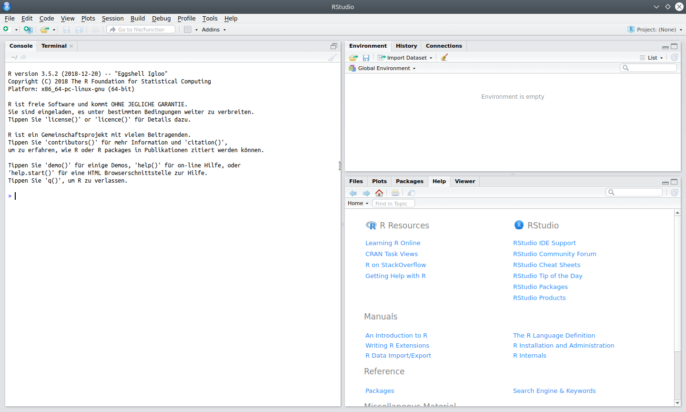
```


Das Programm teilt den Bildschirm in `r margin_note("R läuft links (unten) in der Console")`drei (manchmal auch vier) Fenster auf. Das linke (ggf. untere) Fenster ist unter dem Reiter _Console_ für R reserviert. Alle anderen Fenster enthalten hilfreiches Zubehör von RStudio. 

Zunächst wird Ihnen angezeigt, welche R-Version Sie installiert haben. Für diese Einführung habe ich z.B. die Version 3.5.2 in einer 64 Bit Linux-Version verwendet. Es wird ihnen außerdem mitgeteilt, dass R eine freie Software ist und dass Sie mehr über die Lizenz erfahen können, wenn Sie `licence()` eingeben. Tippen Sie doch einmal `licence()` und drücken Sie dann die Eingabetaste. Sie sollten jetzt  die folgende Anzeige ausgegeben bekommen:   

```{marginfigure}
`licence()` erzeugt eine Ausgabe der R-Lizenz
```
```{r}
licence()
```

Das ist ein typisches Verhalten von R: Sie geben einen Befehl ein, drücken die Eingabetaste und bekommen eine Ausgabe.

## Arbeiten mit *Projekten* {-}
Bevor Sie sich R genauer ansehen, legen Sie aber zunächst einmal ein _Projekt_ an. Das ist wichtig, um später all ihre Daten und Berechnungen einfach wieder zu finden. Klicken Sie im Menü _File_ auf _New Project ..._.  

```{r echo=FALSE, fig.cap="Dialogfelder zur Erstellung eines neuen Projektes", fig.fullwidth=TRUE, out.width="100%"}
knitr::include_graphics("Bilder/NewProject.png")

```

Im folgenden Dialogfed wählen Sie zuerst _New Directory_, dann _New Project_ und geben Sie schließlich den Ordner an, in dem Sie Ihr Projekt speichern wollen, z.B. "~/Dokumente/Studium/Statistik/R Einstieg".  In diesem Ordner werden nun alle Daten, Skripte etc. abgelegt, die Sie im weiteren Verlauf erstellen.

## Einfache Berechnungen mit R {-}
  
Probieren Sie nun Ihre erste statistische Berechnung in R aus, indem Sie den Mittelwert aus den vier Altersangaben 24, 54, 19 und 30 berechnen:

`r margin_note("R als Taschenrechner")`
```{r}
(24 + 54 + 19 + 30) / 4
```
Die obere Zeile zeigt Ihre Eingabe, die Untere Zeile das Ergebnis (`r mean(c(24, 54, 19, 30))`)^[Beachten Sie, dass R einen Punkt als Dezimaltrenner benutzt.].  

Um die Daten nicht immer wieder neu einzugeben, kann man sie einem sogenanten _Objekt_ zuweisen.
```{r}
alter <- c(24, 54, 19, 30)
```
```{marginfigure}
Daten mit `c()` zusammenführen und mit `<-` einem _Objekt_ zuweisen 
```

Mit `c()` haben Sie die Altersangaben aneinander gehängt und mit `<-` (kleiner - minus) dem neu erstellten Objekt `alter` zugewiesen. Zunächst passiert nichts weiter. Jedesmal, wenn Sie jetzt aber `alter` tippen und die Eingabetaste drücken, erhalten Sie den Inhalt dieses Objekts. 

```{r}
alter
```

Nach dem Muster `Name <- Inhalt` können Sie beliebig viele Objekte definieren und im sogenannten _Workspace_ ablegen. Mit dem Befehl `ls()` können Sie sich alle verfügbaren Objekte im Workspace anzeigen lassen.
```{marginfigure}
`ls()` zeigt verfügbare Objeke an
```
```{r}
ls()
```

```{r echo=FALSE, fig.margin = TRUE, out.width = "100%", fig.cap="Anzeige der verfügbaren Objekte im Environment"}
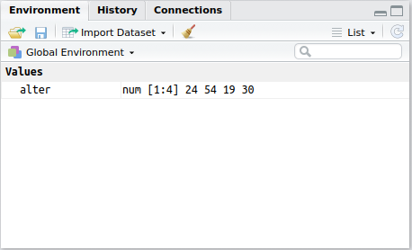
```
Außerdem werden im rechten oberen Fenster die verfügbaren Objekte auch unter dem Reiter _Environment_ angezeigt. In der linken Spalte steht jeweils der Name des Objektes und in der rechten Spalte Informationen zu deren Inhalt.  

`r tufte::newthought("Aus den vorhandenen Altersdaten")` kann man nun zuerst die Summe bilden, ...
```{r}
Summe <- sum(alter)
```
```{marginfigure}
`sum()` berechnet die Summe
```

... dann die Stichprobengröße bestimmen ...
```{r}
N <- length(alter)
```
```{marginfigure}
`length()`: Anzahl der Elemente eines Objektes
```
... und schließlich beides durch einander teilen.
```{r}
Summe / N
```
  

  
Natürlich hat R auch einen eigenen Befehl für den arithmetischen Mittelwert. Er heißt `mean()`.

```{marginfigure}
`mean()` berechnet den arithmetischen Mittelwert
```
```{r}
mean(alter)
```


`r newthought("Sie haben jetzt schon einige Befehle")``r margin_note("Struktur von Befehlen in R")` von R kennen gelernt: `licence()`, `c()`, `sum()`, `length()` und `mean()`. All diese Befehle bestehen aus einem Namen, gefolgt von weiteren Angaben in Klammern.  

Befehle werden in R _Funktionen_ genannt und die Angaben, die in den Klammern folgen, heißen _Argumente_. Die allermeisten Funktionen beinhalten als erstes Argument die Daten, auf die die Funktion angewendet werden soll. Weitere Argumente können (durch Kommata getrennt) folgen. Jede vorgefertigte Funktion hat eine Hilfeseite, auf der genau erklärt wird, wie sie funktioniert.

# Hilfe finden {-}
```{marginfigure}
Hilfe mit `?` aufrufen
```

Zu jeder Funktion gibt es einen Hilfstext, den Sie mit einem voran gestellten `?` aufrufen können. Geben Sie z.B. einmal `?mean` ein. 

```{r echo=FALSE, out.width="100%", fig.margin = TRUE, fig.cap="Ausschnitt aus der Hilfeseite für die Funktion mean()"}
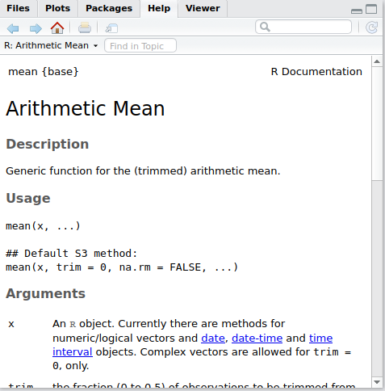
```
Im rechten unteren Fenster wird die entsprechende Hilfeseite aufgerufen. Diese Seiten sind immer gleich aufgebaut: Zuerst gibt es unter __Description__ eine kurze Beschreibung, was die Funktion macht. Unter __Usage__ sehen Sie, welche Eingaben erwartet werden und was die Standardeinstellungen sind. Im Abschnitt __Arguments__ werden alle Argumente beschrieben, die die Funktion enthält. Diese Argumente werden auf manchen Hilfseiten unter dem Stichwort __Details__ ausführlicher beschrieben. Unter __Value__ wird beschrieben, welche Ausgaben erzeugt werden. __References__ nennt Literaturangaben, auf die sich die Funktion bezieht. Unter __See Also__ werden verwandte Funktionen angezeitgt. Schließlich sind die Beispiele unter __Examples__ oft sehr hilfreich, um zu verstehen, wie die Funktion verwendet wird.  

Für die Funktion `mean()` muss man also mindestens angeben, auf welche Daten (x) sie angewendet werden soll. Das Argument `trim = 0` legt fest, dass die Daten nicht getrimmt werden. (Es werden keine Extremwerte ausgeschlossen.) Das Argument `na.rm = FALSE` legt fest, dass fehlende Werte (die werden in R als `NA` gekennzeichnet) nicht ausgeschlossen werden, bevor der Mittelwert berechnet wird. Probieren Sie einmal aus, was das bedeutet.
```{r}
mean(c(24, 54, NA, 30))
```
R kann nicht berechnen, was der Mittelwert aller vier Werte ist, weil für einen dieser Werte keine Angabe vorliegt. Das Ergebnis ist somit wieder ein fehlender Wert (`NA`).  

Wenn man das Argument `na.rm` auf `TRUE` setzt, wird der fehlende Wert vor der Berechnung ausgeschlossen und der Mittelwert aus den verbleibenden drei Werten berechnet.
```{r}
mean(c(24, 54, NA, 30), na.rm = TRUE)
```

`r newthought("Wenn Sie nicht mehr genau wissen")`, wie eine Funktion geschrieben wird, können Sie die ersten Buchstaben tippen und sehen, was RStudio Ihnen als Vervollständigung vorschlägt.

```{r echo = FALSE, out.width = "100%", fig.cap="Automatische Vervollständigungsfunktion von RStudio"} 
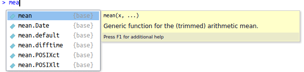
```
Wenn Sie damit nicht weiter kommen, können Sie gesuchte Inhalte `r margin_note("Inhalte mit ?? suchen")`auch mit zwei vorangestellten Fragezeichen eingeben. Es werden dann alle geladenen Hilfe-Seiten nach diesem Begriff durchsucht. Wenn Sie z.B. Hilfe zur Spearman-Korrelation suchen, geben Sie `??Spearman` ein. Es wird Ihnen dann angezeigt, dass es eine Funktion `cor.test()` gibt, die Korrelationen testet - unter anderem auch nach der Spearman-Methode.


Wenn Sie innerhalb von R die benötigte Hilfe nicht bekommen, finden Sie sie bestimmt im Internet. `r margin_note("Internet: \n 'r Suchbegriff' in die Suchmaschiene eingeben")`Geben Sie Ihre Frage nach dem Muster "r Inhalt" in Ihre Suchmaschiene ein. Ihre Frage wurde bestimmt schon einmal gestellt und kompetent beantwortet.  
  
# Daten eingeben {-}
Sie haben bereits eine Methode kennen gelernt, Daten einzugeben nämlich, in dem Sie sie mit `c()` aneinander hängen und mit `<-` einem Objekt `r margin_note("Objektname <- c(Daten)")`zuweisen. Das ist natürlich nur für kleine Datenmengen geeignet.  

`r newthought("Normalerweise werden statistische Datensätze")` in Form `r margin_note("data.frame()")` einer Datenmatrix angelegt, bei der jede Zeile einer statistischen Einheit (z.B. einer befragten Person) entspricht und jede Spalte einer Variable. In R ist so eine Datenmatrix ein `data.frame()`.  
Erstellen Sie erst einmal einen leeren `data.frame()` und weisen Sie ihm dem Objekt *dat* zu, ...
```{r}
dat <- data.frame()
```
... öffnen Sie mit `fix()` die Datenmatrix und geben Sie die Daten wie in Abbildung \@ref(fig:DataEditor) ein.
```{r, eval=FALSE}
fix(dat)
```
```{r DataEditor, echo=FALSE, fig.margin = TRUE, out.width="100%", fig.cap="Data Editor zur Eingabe von Daten in die Datenmatrix"}
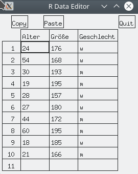
```
Schließen Sie nun den Data Editor (mit *Quit*) und betrachten Sie dann das Ergebnis in R:
```{r, echo=FALSE}
dat <- data.frame(Alter = c(24, 54, 30, 19, 28, 27, 44, 60, 18, 21),
                  Größe = c(176, 168, 193, 195, 157, 180, 172, 195, 185, 166),
                  Geschlecht = c("w", "w", "m", "m", "w", "w", "m", "m", "w", "m"))
```

```{r}
dat
```
Um einzelne Variablen in der Datenmatrix anzuwählen, geben Sie den Namen des `data.frame`-Objektes gefolgt von einem `$` und dann dem Variablennamen an, z.B.:
```{marginfigure}
Variablen in *data.frames* auswählen:
  `data.frame$Variablenname`
```

```{r}
dat$Größe
```

`r newthought("Für größere Datensätze")` ist es dann aber doch besser, die Daten mit externen Programmen (z.B. [EpiData](https://www.epidata.dk/) oder [EpiInfo](https://www.cdc.gov/epiinfo/)) einzgeben und in R zu importieren. Die zuverlässigste Art das zu tun ist es, die Daten in einem Text-Format (z.B. csv-Format) zu speichern und in R dann mit `read.table()` einzulesen. Diese Funktion hat sehr viele Argumente, die es ermöglichen fast jedes Text-Format korrekt zu lesen.
```{marginfigure}
Textdateien einlesen mit `read.table()`
```
  
```{marginfigure}
Mit dem Paket *foreign* Daten aus anderen Statistikprogrammen einlesen
```
Man kann aber auch andere Datenformate problemlos einlesen. Das Paket *foreign* erlaubt es z.B. Dateien aus anderen Statistikprogrammen wie SAS oder SPSS einzulesen.

# Pakete {-}
Es kann sein, dass Sie für eine gewünschte Prozedur zunächst keine Funktion finden. In den meisten Fällen gibt es dann ein Zusatzpaket mir so einer Funktion, das Sie nutzen können. `r margin_note("R-Pakete unter https://cran.r-project.org")` Zur Zeit stehen etwas über 14000 solcher Pakete auf den offiziellen R-Servern zur Verfügung. Sie können Sie sich unter https://cran.r-project.org ansehen.

Zuerst müssen Sie ein Paket mit dem Befehl 
```{marginfigure}
Pakete mit `install.packages()` installieren
```
```{r eval=FALSE}
install.packages("Paketname")
```

installieren. Der Befehl läd das Paket automatisch herunter und installiert es.  
Um ein installiertes Paket zu nutzen, muss man es dann bei jeder neuen R-Sitzung erneut laden. 

```{marginfigure}
Paket mit `library()` laden
```
```{r eval=FALSE}
library("Paketname")
```

```{r, echo = FALSE, fig.margin = TRUE, out.width="100%", fig.cap="RStudio-Fenster Packages"}
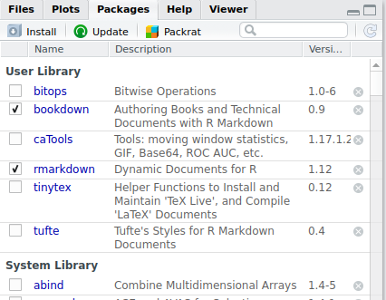
``` 

`r newthought("R-Studio bietet Ihnen")` im rechten unteren Fenster unter *Packages* grafische Hilfsmittel zur Paketverwaltung an. Es werden dort alle installierten Pakete angezeigt. Die geladenen Pakete sind mit einem Häkchen markiert. Wenn Sie auf den Namen eines Paketes klicken, kommen Sie zu den zugehörigen Hilfe-Seiten.

Mit {height=17px} können Sie neue Pakete installieren.

# Grafiken {-}

Mit R können Sie sehr einfach statistische Grafiken erstellen. Sie können diese Grafiken bis ins kleinste Detail ganz genau so gestalten, wie Sie das möchten. (Dann wird es allerdings etwas komplizierter). Hier ist erst einmal ein ganz einfaches Beispiel:
```{r fig.asp = 0.8, fig.cap="Boxplot der Altersangaben, aufgeteilt nach Geschlecht (fiktive Daten)."}
boxplot(dat$Alter ~ dat$Geschlecht)
```

Mehr Beispiele können Sie sich mit folgender Eingabe ansehen:
```{r, eval=FALSE}
demo(graphics)
```
Weitere Beispiele gibt es in der R Graph Gallery https://www.r-graph-gallery.com/ und für interaktive Grafiken unter https://shiny.rstudio.com/gallery/.
  
# History und Skript {-}
```{marginfigure}
Mit *Pfeil-nach-oben* die letzten Funktionen wieder aufrufen
```

Meistens wird eine Funktion beim ersten Versuch nicht genau das machen, was Sie sich gedacht haben, sondern Sie müssen sie erst noch ein bisschen weiter bearbeiten, bevor Sie zufrieden sind. Sie müssen dann nicht jedes mal die ganze Funktion neu eintippen, sondern können mit der Pfeil-nach-oben-Taste die zuletzt ausgeführten Funktionen noch einmal aufrufen.  

```{r history, echo = FALSE, fig.margin = TRUE, out.width="100%", fig.cap="History-Fenster in RStudio"}
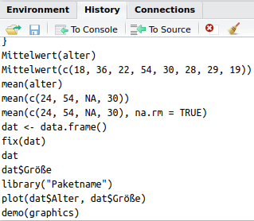
```
RStudio zeigt Ihnen die zuletzt verwendeten Funktionen auch (rechts oben) im Fenster *History* an (siehe Abb. \@ref(fig:history)). Sie können dort ausgewählte Funktionen mit {height=17px} in die Konsole kopieren, oder mit 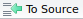{height=17px} in eine Skript-Datei, in der Sie Ihre Arbeitsschritte speichern und protokollieren können.


`r newthought("Es ist unbedingt empfehlenswert,")` mit solchen Skript-Dateien zu arbeiten. Ein neues Skript erstellen Sie, indem Sie links oben 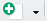{height=17px} und dann 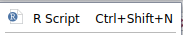{height=17px} klicken. Um einzelne Funktionen aus dem Skript heraus auszuführen, klicken Sie 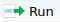{height=17px} oder drücken Sie *STRG-Enter*. Das gesamte Skript können Sie mit 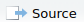{height=17px} ausführen, oder Sie können in der Konsole die Funktion `source()` ausführen.
```{marginfigure}
Ein Skript mit `source()` auszuführen.
```
```{r, eval=FALSE}
source("Name_der_Skriptdatei.R")
```
  
```{marginfigure}
Kommentieren mit \#.
```
Kommentieren Sie Ihr Skript mit *#*, damit Sie Ihre Arbeit später noch nachvollziehen können. Im Sinne von Nachvollziehbarkeit und Reproduzierbarkeit sollten die gesamte Datenaufbereitung und Datenanalyse als Skript speichern. Abbildung \@ref(fig:skript) zeigt ein Beispiel für solch ein Skript.

```{r skript, echo = FALSE, fig.fullwidth = TRUE, out.width="100%", fig.cap="Beipiel für ein R-Stkript"}
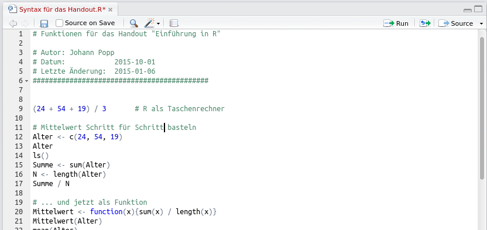
```


# Ergebnisse Speichern {-}

Sie können das Skript speichern, indem Sie auf das Diskettensymbol am oberen Rand klicken. Standardmäßig wird es in den Ordner gespeichert, in dem Sie ihr Projekt angelegt haben. In der Regel ist das schon ausreichend, wenn Sie nämlich den ganzen Arbeitsablauf vom laden der Daten bis zur Berechnung der Ergebnisse in diesem Skript erledigen. Trotzdem kann es eine gute Idee sein, die Daten noch einmal separat zu speichern.

Sie können den Gesamten *Workspace* - also alle Objekte, die Sie im Fenster *Environment* sehen - mit der Funktion

```{marginfigure}
Workspace mit `save.image()` speichern
```
```{r eval=FALSE}
save.image("Dateiname.RData")
```
speichern. Die Dateinamensendung ist dabei immer ".RData".  Spater können Sie ihn dann mit
```{marginfigure}
Workspace mit `load()` laden
```
```{r eval=FALSE}
load("Dateiname.RData")
```
wieder laden.

`r tufte::newthought("Sie können Datensätze auch als Textdatei")` speichern. Hier zum Beispiel den oben erzeugten `data.frame()` "dat", mit dem Dateinamen "Testdaten.txt" und mit einem Semikolon als Trennzeichen:
```{marginfigure}
Datensätze mit `write.table()` speichern
```
```{r}
write.table(dat, "Testdaten.txt", sep = ";")
```
Abbildung \@ref(fig:Textdatei) zeigt den Inhalt der erzeugten Datei. Sie lässt sich mit `read.table()` später wieder in R einlesen.

```{r Textdatei, echo=FALSE, fig.margin = TRUE, out.width="100%", fig.cap="Inhalt einer mit write.table() erstellten Textdatei"}
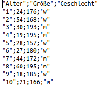
```
```{r}
read.table("Testdaten.txt", header = TRUE, sep = ";")
```


# Literatur {-}