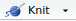

# Skript für eine erste Einführung in R

Hauptbestandteil des Skripts ist die R-Markdown-Datei "Erster R-Rundgang.Rmd". Wenn man sie in RStudio öffnet, wird am oberen Fensterrand {height=17px} angezeigt. Wenn man darauf klickt, kann man wählen, ob man eine html-Datei oder eine pdf-Datei erstellt. (Für eine pdf-Datei muss LaTex installiert sein.) Die Vorlagen sind im Tufte-Format und benötigen die Pakete `knitr` und `bookdown`. Beide Pakete sollten automatisch installiert sein, wenn man RStudio verwendendet. Falls nicht, muss man sie nachinstallieren.

Das Skript enthält viele Screenshots, die im Dateiordner "Bilder" gespeichert sind. Dieser Ordner muss sich im gleichen Verzeichnis wie die Rmd-Datei befinden, damit die Erstellung des Skripts funktioniert. Außerdem wird die Datei "references.bib" benötigt, um die Literaturzitationen einzufügen. Die Datei "geistes-und-kulturwissenschaften-heilmann.csl" bestimmt das Format der Zitationen. Schließlich braucht man die Datei "_bookdown.yml", damit die Abbbildungen in Deutsch mit "Abbildung" beschriftet werden und nicht mir "Figure".